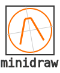

<p align="center">

</p>

*A minimal, composable 2D drawing library for Python.*

**minidraw** lets you build and transform vector drawings in code — as easily as working with geometric objects.
No heavy dependencies, no GUI required — just pure Python objects that you can **render to SVG** or **export as code**.

---

### 🚀 Quick Start

```python
from minidraw import Drawing, Line, Circle, Style

# Create a new drawing
d = Drawing()

# Add shapes
line = Line((10, 10), (100, 60), style=Style(stroke="black"))
circle = Circle((80, 40), 20, style=Style(stroke="red", fill="none"))

d.add(line, circle)

# Transform and duplicate
circle.copy().translate(40, 0).scale(1.2)

# Export
d.render_to_file("example.svg")     # → SVG image
print(d.render_to_string("python")) # → Reproducible Python code
```

👉 **Output:** clean SVG or equivalent Python code that rebuilds the scene.

---

### 🧠 Core Concepts

| Concept        | Description                                                             |
| -------------- | ----------------------------------------------------------------------- |
| **Primitives** | Basic shapes (`Line`, `Circle`, `Rectangle`, `Polyline`, `Arc`, `Text`) |
| **Group**      | Container that applies transforms to child primitives                   |
| **Drawing**    | Top-level group with export methods                                     |
| **Point**      | Transformable coordinate supporting local references                    |
| **Style**      | Declarative stroke/fill/text properties                                 |
| **Backends**   | Flexible exporters (`SVGBackend`, `PythonBackend`, or your own)         |

Everything derives from `Spatial`, giving all objects a consistent transformation API.

---

### 🔄 Transform Anything

All primitives share the same fluent interface:

```python
shape.translate(20, 0).rotate(45).scale(1.5).mirror((0, 0), (0, 1))
```

Transformations mutate in place — or use `.copy()` to duplicate first.

Available methods:

* `translate(dx, dy)`
* `rotate(angle_deg, center=None)`
* `scale(sx, sy=None, center=None)`
* `mirror(axis_p1, axis_p2)`
* `flip_lr()` and `flip_ud()` for quick reflections

---

### 🎨 Styling Made Simple

```python
Style(
    stroke="#333",
    stroke_width=2,
    fill="none",
    opacity=0.8,
    font_size=12,
)
```

You can combine or override styles with:

```python
child_style = Style(stroke="red").merged(parent_style)
```

---

### 🧹 Example: Building a Technical Diagram

```python
from minidraw import Drawing, Line, Circle, Group, Style

g = Group(style=Style(stroke="#666"))
g.add(
    Line((0, 0), (50, 0)),
    Circle((25, 0), 8, style=Style(stroke="red", fill="none")),
)

# Duplicate with rotation
gear = g.copy().rotate(45)
d = Drawing()
d.add(g, gear)

d.render_to_file("gear.svg")
```

👉 The result: a clean, rotated gear-like structure drawn entirely from Python.

---

### 🧰 Extend with Backends

Write your own renderer by subclassing `Backend`:

```python
class JSONBackend(Backend):
    def render_to_string(self, elements):
        return json.dumps([e.__dict__ for e in elements])
```

---

### 📦 Installation

```bash
pip install minidraw
```

or from source:

```bash
git clone https://github.com/yourname/minidraw.git
cd minidraw
pip install -e .
```

---

### 💡 Why You’ll Love It

* Pure Python — no C extensions, no graphics dependencies.
* Intuitive, fluent API that feels like manipulating geometry, not pixels.
* Human-readable exports — your drawings are code, not opaque files.
* Perfect for **procedural art**, **geometry experiments**, or **generating SVG assets**.

---

### 🪪 License

MIT License © 2025 — created for clarity, learning, and playful geometry.
